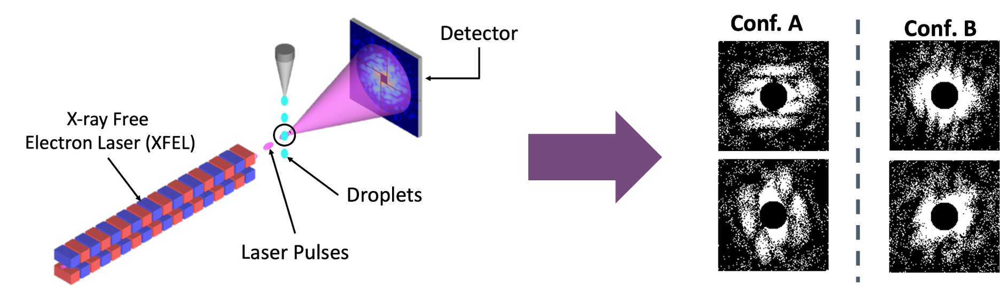
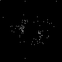
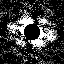
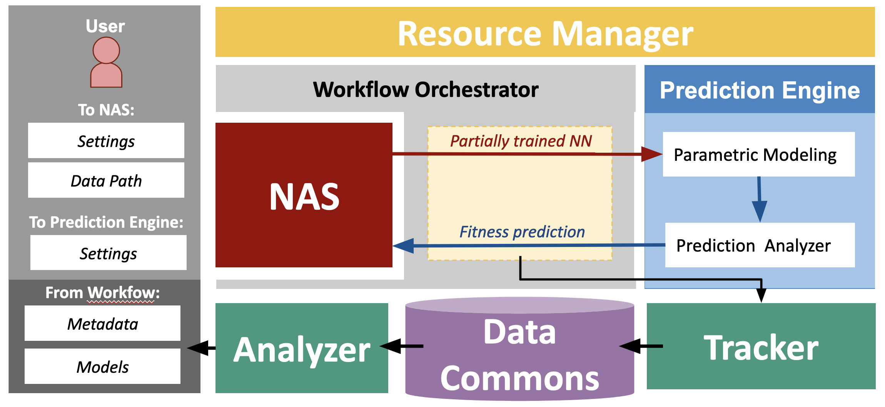
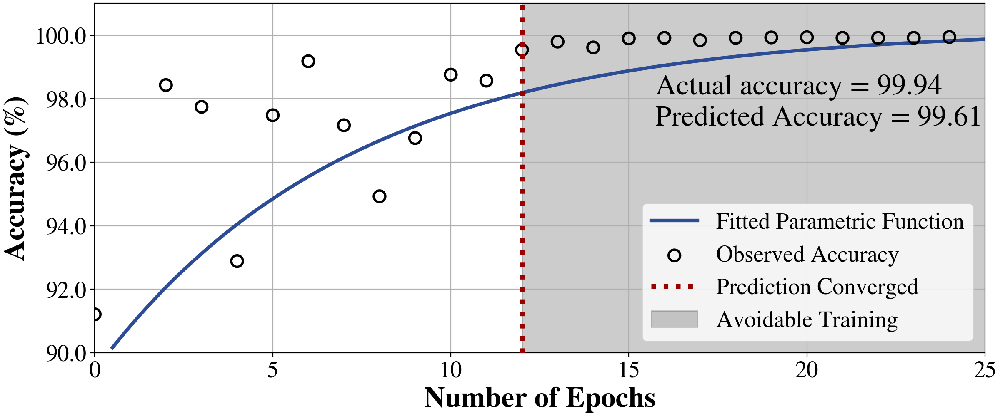
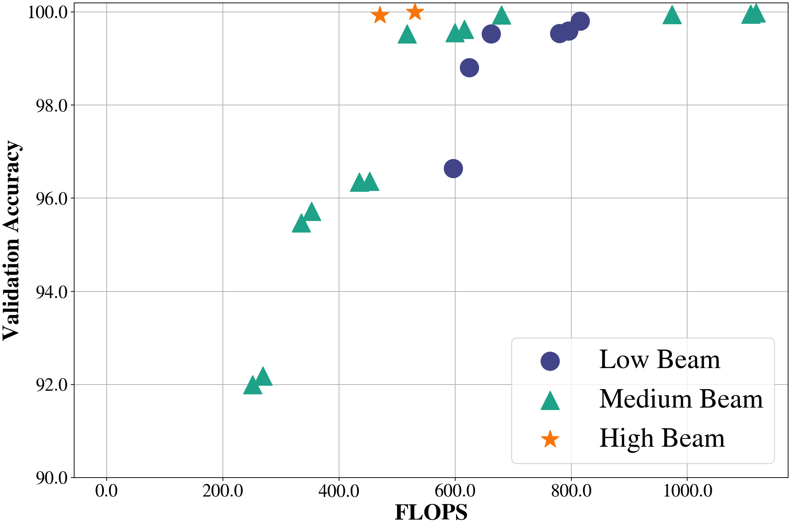
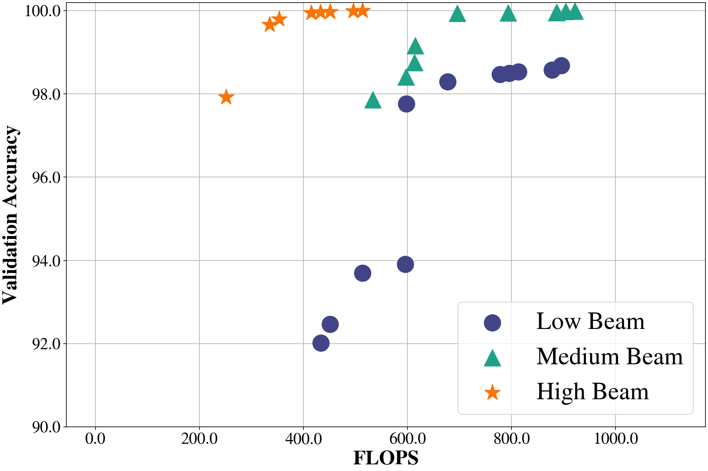
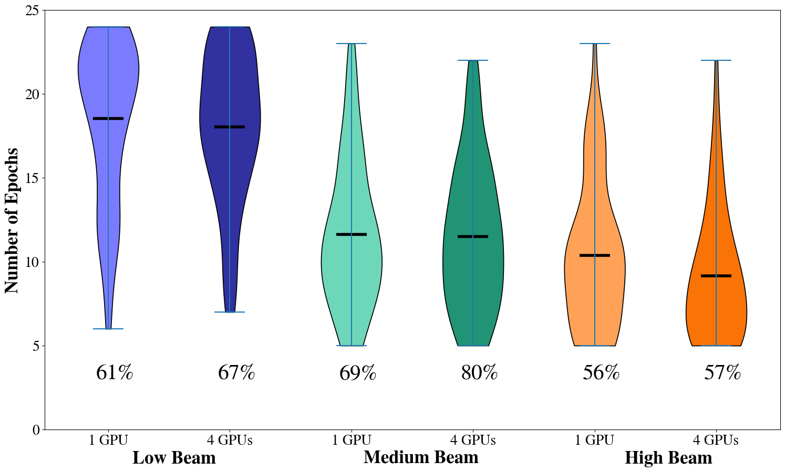
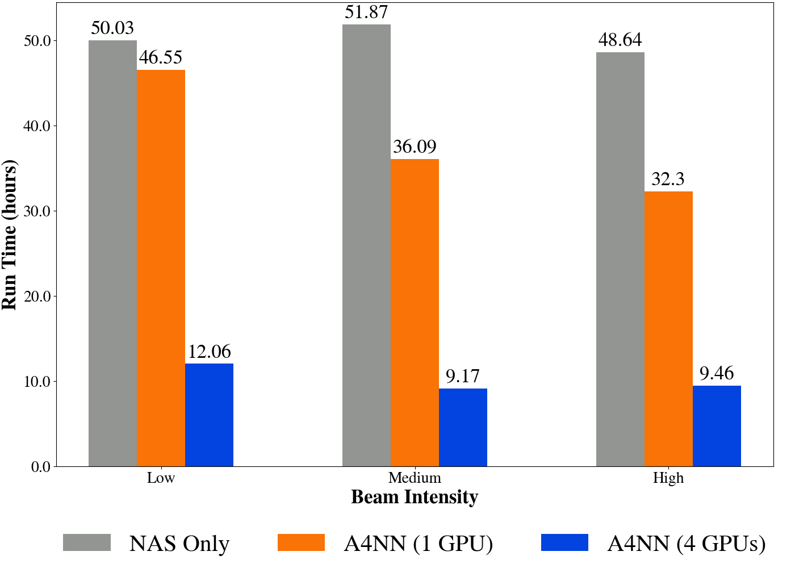

# Paper and Results Reproducibility: Composable Workflow for Accelerating Neural Architecture Search Using In Situ Analytics for Protein Classification

We design A4NN, a highly efficient, composable workflow that leverages existing NAS and in situ parametric predictions to classify protein conformations from protein diffraction image datasets. We rigorously record neural architecture histories, model states, and metadata to reproduce the search for near-optimal NNs and publish the output results, rather than the software, as a **_reproducibility artifact_** in this GitHub repository and our Harvard Dataverse repository (see Quick Links). We demonstrate A4NN’s ability to reduce training time and resource consumption on a real dataset generated by an X-ray Free Electron Laser (XFEL) experiment. We discuss how the workflow can deploy across a broader spectrum of NAS and datasets in our ICPP 2023 paper.

This artifact contains metadata and results from our workflow executions on several protein diffraction datasets for different GPU distributions. Additionally, the artifact contains build information for the Conda environments and Python scripts that reproduce the figures in our paper and allow the user to produce their predictions from the created models. All build information, including Python scripts, XFEL datasets, model architectures, and metadata, are included to reinforce the reproducibility of our results.


## Contents
* [Protein Diffraction Dataset](https://github.com/TauferLab/Paper_2023_IEEEICPP_A4NN/tree/main#protein-diffraction-dataset)
* [A4NN Workflow](https://github.com/TauferLab/Paper_2023_IEEEICPP_A4NN/tree/main#a4nn-workflow)
* [Repository Structure](https://github.com/TauferLab/Paper_2023_IEEEICPP_A4NN/tree/main#repository-structure)
* [Downloading Datasets and Models](https://github.com/TauferLab/Paper_2023_IEEEICPP_A4NN/tree/main#downloading-datasets-and-models)
* [Requirements](https://github.com/TauferLab/Paper_2023_IEEEICPP_A4NN/tree/main#requirements)
* [Installation](https://github.com/TauferLab/Paper_2023_IEEEICPP_A4NN/tree/main#installation-10-minutes)
* [Running Predictions](https://github.com/TauferLab/Paper_2023_IEEEICPP_A4NN/tree/main#running-predictions-2-minutes)
* [Analyzing Results](https://github.com/TauferLab/Paper_2023_IEEEICPP_A4NN/tree/main#analyzing-results-2-minutes)
* [Reproducing Results](https://github.com/TauferLab/Paper_2023_IEEEICPP_A4NN/tree/main#reproducing-results)
* [Other Relevant Publications](https://github.com/TauferLab/Paper_2023_IEEEICPP_A4NN/tree/main#other-relevant-publications)
* [Copyright and License](https://github.com/TauferLab/Paper_2023_IEEEICPP_A4NN/tree/main#copyright-and-license)


## Quick Links
* **Harvard Dataverse:** <a href="https://doi.org/10.7910/DVN/JS9FR6" target="_blank">Architecture Descriptions, Model Checkpoints, and Training Histories for A4NN Workflow on Protein Diffraction Data</a>

## Citation: 

Georgia Channing, Ria Patel, Paula Olaya, Ariel Keller Rorabaugh, Osamu Miyashita, Silvina Caino-Lores, Catherine Schuman, Florence Tama, and Michela Taufer. “Composable Workflow for Accelerating Neural Architecture Search Using In Situ Analytics for Protein Characterization”. _In: Proceedings of the 52nd International Conference on Parallel Processing (ICPP)_. Salt Lake City, UT, USA: ACM, Aug. 2023, pp. 1–10


# Protein Diffraction Dataset
All 3 datasets in `protein_dataset/` are generated with the following apparatus. This is an overview of an X-ray Free Electron Laser (XFEL) experiment generating two different sets of patterns for two conformations of the same EF2 protein. 
<p align="center"></p>


The following are some of the images from within this repo. We have diffraction patterns from laser beams at low, medium, and high intensities, respectively. Notice how the resolution becomes more detailed as the beam intensity increases.
<p align="center">



</p>


# A4NN Workflow
This is the full A4NN workflow. We include it here as a reference since this artifact focuses mainly on the reproducibility of the tracker, data commons, analyzer, and outputs (metadata and models) part of the workflow. 
<p align="center"></p>


# Repository Structure
There are 4 directories within this repository:
* `environments/`: contains 2 Conda environment files that contain all Python package dependencies necessary to run the scripts. There is a CPU and a GPU (CUDA devices only) version of the files available.

* `icpp_training_results/`: contains tables that record the training data for all NN models within each experiment

* `scripts/`: contains a Jupyter Notebook (and a Python script version of the Jupyter Notebook) that allows for interactively reproducing figures from the paper. It also includes a Python script for using a specific model to predict the dataset.

* `images/`: contains images used in `README.md` file for this repository


# Prerequisites

## Environment Requirements
The following requirements are necessary to build the environment from the YAML files within the `environments/` directory.
* Conda package manager: any recent versions (e.g. 23.3.1, 22.11.0, etc.)
* Python: at least version 3.9

Refer to the article [Using Anaconda on older operating systems](https://docs.anaconda.com/free/anaconda/install/old-os/) if the local machine OS does not support the versions above.

## File Storage Requirements
* 70GB of storage is required if all datasets and models are to be used for predictions. It is possible to unzip some datasets and their corresponding experiment models. This is explained in the [Installation](https://github.com/TauferLab/Paper_2023_IEEEICPP_A4NN/tree/main#installation) section.


# Downloading Datasets and Models
The protein diffraction datasets we used in this paper are located in <a href="https://doi.org/10.7910/DVN/JS9FR6" target="_blank">Harvard Dataverse</a>. _Change your view of the Harvard Dataverse repository to "Tree View" to organize all the files according to the structure defined in this section._

It is necessary to organize the files once downloaded to comply with the below directory structures.

`protein_dataset/`: contains Bzip2 archives that have simulated protein diffraction pattern images for low, medium, and high beam intensities. Used as input dataset for `predict.py`
   * Datasets are in the Bzip2 files `1e14.zip.bz2`, `1e15.zip.bz2`, and `1e16.zip.bz2`. _Move these files to this `protein_dataset/` directory._
   * `1e14/`, `1e15/`, and `1e16/` will be in this directory after running `setup.sh` script (later in the [Installation](https://github.com/TauferLab/Paper_2023_IEEEICPP_A4NN/tree/main#installation) section). 
   * Each dataset is 4.8GB after unzipping, making a **_total of 15GB_** for all 3 datasets. Each dataset contains 63,508 images for training and 15,876 images for testing (80/20 train-test split). 
   * There are **_238,152 images_** in total for all 3 datasets.

`models/`: contains ZIP archives that include all packaged models generated from our experiments using each protein diffraction dataset (low, medium, high beam intensities) and different GPU distributions. These models are used as input models for `predict.py`. These will be unzipped in the `setup.sh` script (later in the [Installation](https://github.com/TauferLab/Paper_2023_IEEEICPP_A4NN/tree/main#installation) section). 
* Each experiment contains 100 models that train for a max of 25 epochs each. There are approximately **_72,900 model-related files_** in total.
* Each experiment on the 3 datasets are broken down to the following storage requirements. All models unzipped require **_55GB of file storage_**.
   * `gpu1/`
      * `early_termination/` 
         * 1e14 models - 2.5GB after unzipping
         * 1e15 models - 2.0GB after unzipping
         * 1e16 models - 1.5GB after unzipping
      * `no_early_termination/` 
         * 1e14 models - 3.0GB after unzipping
         * 1e15 models - 2.9GB after unzipping
         * 1e16 models - 2.0GB after unzipping
   * `gpu4/`
      * `early_termination/`
         * 1e14 models - 2.7GB after unzipping
         * 1e15 models - 1.8GB after unzipping
         * 1e16 models - 1.7GB after unzipping


# Installation (Execution Time: ~10 Minutes)

Run the setup script by running `./setup.sh` in the command line. This command will build the necessary Conda environment, unzip all protein diffraction image datasets, and unzip all pre-trained models.

Uncomment the necessary version of the Conda environment to be built within the `setup.sh` script. The default is the CPU version.

## Important Note

If running this setup script, it will unzip all data and models. It requires a **_total of 70GB_** on the local machine. If there is not enough storage, it will suffice to comment out certain experiment models in the setup.sh script. 

For example, if you want to run predictions with models from `gpu1/early_termination/`, you only need to comment out the lines in the setup script that unzip the other experiment directories `gpu1/no_early_termination/` and `gpu4/early_termination/`, which are Lines 37-52 in `setup.sh`. 

If you want to run a model from `gpu1/early_termination/` on protein diffraction dataset `1e14/`, then you can comment out the lines that unzip `gpu1_1e15_early_termination_FULL.zip` and `gpu1_1e16_early_termination_FULL.zip`, which are Lines 33-34 in `setup.sh`.


# Running Predictions (Execution Time: ~2 Minutes)

Run `conda activate icpp_nsga_net` to activate the newly created Conda environment.

To use a specific model to perform predictions on the dataset, run `predict.py`. There are two arguments to include when running the script: `--model_path` and `--data_path`.
* `scripts/predict.py` has the following arguments:
   * `--model_path` - Location of the model file 
      * Ex. `gpu1/early_termination/classification-search-penguin-pd_exv100_1gpu_25e_1e14-macro-20230407-161446/arch_99/arch_99_epoch_18.pt`
   * `--data_path` - Location of the dataset to predict on 
      * Ex. `protein_dataset/1e14/images/testset`
   * `--out_path` (optional) - Location to place output files `predictions.csv` and `prediction_analysis.txt`. 
      * The default location is `model_path`

### Example Usage
Here is an example of using a pre-trained model to perform predictions on the protein diffraction dataset for 1e14. Here, NN model 68 that is generated from a single GPU not using the early termination method is used after fully training it. Note that any NN model can be used from any epoch to check the performance of the models at any point in time. 
   ```
   $ python predict.py --model_path ../models/gpu1/no_early_termination/classification-search-penguin-pd_exv100_1gpu_25e_1e14-macro-20230328-061437/arch_68/arch_68_epoch_24.pt --data_path ../protein_dataset/1e14
   ```


# Analyzing Reproduced Results (Execution Time: ~2 Minutes)
* To reproduce figures from the paper, either run an interactive session with the Jupyter Notebook `paper_analysis.ipynb` or execute the `paper_analysis.py` script. 
   * Use the Python script if there is no access to Jupyter Notebooks on the local machine. To run `paper_analysis.py`, use the following command: `python paper_analysis.py`
* All figures will be included in the generated `figures/` folder.


Reproduce the figures from the ICPP paper:
```
# Launch Python script
python paper_analysis.py

# OR 

# Launch Jupyter Notebook
jupyter notebook paper_analysis.ipynb
```

The following images are what you should see when reproducing the figures in the Python script or Jupyter Notebook. They should match the figures in the paper (not including captions).

<p align="center"><em>Figure 2: Example of the fitness (accuracy) prediction for a NN trained on our use case </em></p>
<p align="center"></p>

<p align="center"><em>Figures 6a, 6b: Validation accuracy and FLOPS of the Pareto optimal models for A4NN and NSGA-Net for the three beam intensities.</em></p>
<p align="center">


</p>

<p align="center"><em>Figure 7: Epochs required for testing 100 architectures, percentages of savings associated with A4NN when using one and four GPUs, and percentage of gains with A4NN over the standalone NAS when using one and four GPUs.</em></p>
<p align="center"></p>

<p align="center"><em>Figure 8:  Effect of the different beam intensities on the convergence of the model’s predictions in terms of the number of epochs and the percentage of the converged models.</em></p>
<p align="center"></p>

<p align="center"><em>Figure 9: Wall times required by the training in A4NN workflow and standalone NAS for the three beam intensities using one GPU (for the A4NN and NSGA-Net) and for four GPUs (for A4NN).</em></p>
<p align="center"></p>


# Other Relevant Publications

1. Paula Olaya, Silvina Caino-Lores, Vanessa Lama, Ria Patel, Ariel Keller Rorabaugh, Osamu Miyashita, Florence Tama, and Michela Taufer. 2022. Identifying structural properties of proteins from X-ray free-electron laser diffraction patterns. _2022 IEEE 18th International Conference on e-Science (e-Science) (2022)_. https://doi.org/10.1109/escience55777.2022.00017

2. Ria Patel, Ariel Keller Rorabaugh, Paula Olaya, Silvina Caino-Lores, Georgia Channing, Catherine Schuman, Osamu Miyashita, Florence Tama, and Michela Taufer. 2022. A methodology to generate efficient neural networks for the classification of scientific datasets. _2022 IEEE 18th International Conference on e-Science (e-Science) (2022)_. https://doi.org/10.1109/escience55777.2022.00052

3. Ariel Keller Rorabaugh, Silvina Caíno-Lores, Travis Johnston, and Michela Taufer. 2022. Building High-Throughput Neural Architecture Search Workflows via a Decoupled Fitness Prediction Engine. _IEEE Transactions on Parallel and Distributed Systems_ 33, 11 (2022), 2913–2926. https://doi.org/10.1109/TPDS.2022.3140681

4. Ariel Keller Rorabaugh, Silvina Caíno-Lores, Michael R. Wyatt II, Travis Johnston, and Michela Taufer. 2021. Architecture Descriptions and High-Frequency Accuracy and Loss Data of Random Neural Networks Trained on Image Datasets. Available: https://doi.org/10.7910/DVN/ZXTCGF


# Copyright and License
Copyright (c) 2023, Global Computing Lab

A4NN is distributed under terms of the [Apache License, Version 2.0](https://www.apache.org/licenses/LICENSE-2.0) with LLVM Exceptions.

See [LICENSE](LICENSE) for more details.


