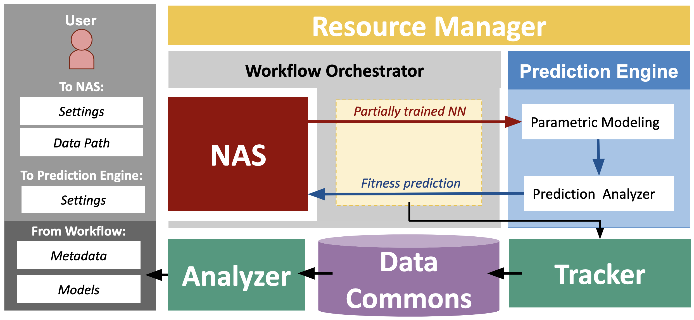
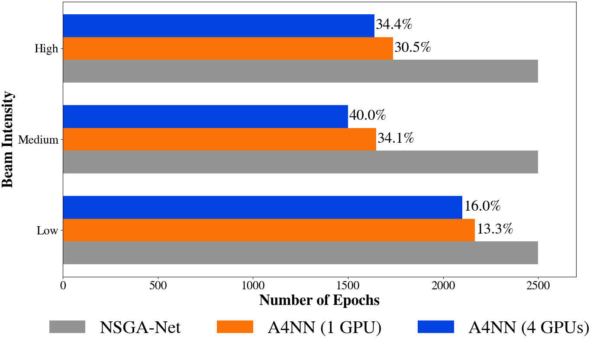

# Analytics For Neural Networks Workflow (A4NN) on Protein Diffraction Data

Analytics for Neural Networks (A4NN) is a composable workflow that aims to reduce the time and resources required to design accurate and efficient NN architectures with the least amount of human intervention as possible. Our workflow integrates a parametric fitness prediction strategy and distributes training across multiple accelerators to decrease the aggregated NN training time. Furthermore, our workflow rigorously records neural architecture histories, model states, and metadata to reproduce the search for near-optimal NNs. We demonstrate the workflow’s ability to reduce training time and resource consumption on a real dataset generated by an X-ray Free Electron Laser (XFEL) experiment. When deploying the whole workflow, we decrease training time by up to 37% and epochs required by up to 38%.

This artifact contains metadata and results from our workflow executions for different GPU distributions and on different datasets. Additionally, the artifact contains build information for the Conda environments and Python scripts that reproduce the figures from the paper [[1]](https://github.com/TauferLab/Paper_2023_IEEEICPP_A4NN/tree/main#publications) and allow the user to produce their own predictions from the created models. All build information, including Python scripts, XFEL datasets, model architectures, and metadata, are included to reinforce the reproducibility of our results. 


# Protein Diffraction Dataset
All 3 datasets in `protein_dataset/` are generating with the following apparatus. This is an overview of an X-ray Free Electron Laser (XFEL) experiment generating two different sets of patterns for two conformations of the same eEF2 protein. More about this setup in [[1]](https://github.com/TauferLab/Paper_2023_IEEEICPP_A4NN/tree/main#publications). 
<p align="center"></p>


The following are some of the images from within this repo. We have diffraction patterns from laser beams at low, medium, and high intensities, respectively. Notice how the resolution becomes more detailed as the beam intensity is increased.
<p align="center">


</p>


# A4NN Workflow
This is the full A4NN workflow, as mentioned in [[1]](https://github.com/TauferLab/Paper_2023_IEEEICPP_A4NN/tree/main#publications). We include it here as a reference since this artifact focuses mainly on the reproducibility of the tracker, data commons, analyzer, metadata, and models part of the workflow. 
<p align="center"></p>


# Repository Structure
There are 5 sections within this repository.

* `environments/`: contains 2 Conda environment files that contain all python package dependencies necessary to run the scripts. There is a CPU and a GPU (CUDA devices only) version of the files available.

* `models/`: contains ZIP archives that include all packaged models generated from our experiments using each protein diffraction dataset (low, medium, high beam intensities), which are listed below:
    * 1 GPU - `early_termination` and `no_early_termination` 
    * 4 GPUs - `early_termination`

* `icpp_training_results/`: contains tables that record the training data for all NN models within each experiment

* `protein_dataset/`: contains ZIP archives that have simulated protein diffraction pattern images for low, medium, and high beam intensities. Used as input dataset for `predict.py`

* `scripts/`: contains a Jupyter Notebook (and a Python script version of the Jupyter Notebook) that allows for interactively reproducing figures from the paper [[1]](https://github.com/TauferLab/Paper_2023_IEEEICPP_A4NN/tree/main#publications). Also, includes Python script for using a specific model to predict on the dataset.


# Requirements/Prerequisites
The following requirements are necessary to build the environment from the YAML files within the `environments/` directory.
* Conda package manager: any recent versions (e.g. 23.3.1, 22.11.0, etc.)
* Python: at least version 3.9

Refer to the article [Using Anaconda on older operating systems](https://docs.anaconda.com/free/anaconda/install/old-os/) if the local machine OS does not support the versions above.


# Installation (~10 Minutes)

Please run the setup script by running `./setup.sh` in the command line. This command will build the necessary Conda environment, unzip all protein diffraction image datasets, and unzip all pretrained models.

**Note**: Please uncomment the necessary version of the Conda environment to be built within the `setup.sh` script. Default is CPU version.


# Running Predictions (~2 Minutes)

* To use a specific model to perform predictions on the dataset, run `predict.py`. There are two arguments to include when running the script: `--model_path` and `--data_path`.

* `scripts/predict.py` has the following arguments:
   * `--model_path` - Location of the model file (ex. `gpu1/stopping/1e14/arch_99/arch_99_epoch_24.pt`)
   * `--data_path` - Location of dataset to predict on (ex. `protein_dataset/1e14/images/testset`)
   * `--out_path` (optional) - Location to put result files `predictions.csv` and `prediction_analysis.txt`. Default location is the `model_path`


# Analyzing Results (~2 Minutes)
* To reproduce figures from the paper, either run an interactive session with the Jupyter Notebook `paper_analysis.ipynb` or execute the `paper_analysis.py` script. 
   * Use the python script if there is no access to Jupyter Notebooks on the local machine. To run `paper_analysis.py`, use the following command: `python paper_analysis.py`
   * All figures will be included in the `figures/` folder.


# Examples

1. Use a pre-trained model to perform predictions. Here, NN model 68 is used after training the last epoch. Please note that any NN model can be used from any epoch to check the performance of the models. 
   ```
   $ python predict.py --model_path $HOME/Desktop/icpp/models/gpu1/no_early_termination/classification-search-penguin-pd_exv100_1gpu_25e_1e14-macro-20230328-061437/arch_68/arch_68_epoch_24.pt --data_path $HOME/Desktop/icpp/protein_dataset/1e14
   ```

2. Reproduce the figures from the ICPP paper [[1]](https://github.com/TauferLab/Paper_2023_IEEEICPP_A4NN/tree/main#publications):
    ```
    # Launch Python script
    python paper_analysis.py

    # OR 
    
    # Launch Jupyter Notebook
    jupyter notebook paper_analysis.ipynb
    ```

    All figures will be saved to the `figures/` directory that is created after running the program. The following images are what you should see when reproducing the figures in the Python script or Jupyter Notebook.

<p align="center"><em>Figure 2: Example of the fitness (accuracy) prediction for a NN trained on our use case </em></p>
<p align="center"></p>

<p align="center"><em>Figures 6a, 6b: Validation accuracy and FLOPS of the Pareto optimal models for NAME and NSGA-Net for the three beam intensities.</em></p>
<p align="center">


</p>

<p align="center"><em>Figure 7: Epochs required for testing 100 architectures, percentages of savings associated with NAME when using one and four GPUs, and percentage of gains with NAME over the standalone NAS when using one and four GPUs.</em></p>
<p align="center"></p>

<p align="center"><em>Figure 8:  Effect of the different beam intensities on the convergence of the model’s predictions in terms of the number of epochs and the percentage of the converged models.</em></p>
<p align="center"></p>

<p align="center"><em>Figure 9: Wall times required by the training in NAME work- flow and standalone NAS for the three beam intensities using one GPU (for the NAME and NSGA-Net) and for four GPUs (for NAME).</em></p>
<p align="center"></p>


# Publications
1. Georgia Channing, Ria Patel, Paula Olaya, Ariel Keller Rorabaugh, Osamu Miyashita, Silvina Caino-Lores, Catherine Schuman, Florence Tama, and Michela Taufer. “Composable Workflow for Accelerating Neural Architecture Search Using In Situ Analytics for Protein Characterization”. _In: Proceedings of the 52nd International Conference on Parallel Processing (ICPP)_. Salt Lake City, UT, USA: ACM, Aug. 2023, pp. 1–10

2. Paula Olaya, Silvina Caino-Lores, Vanessa Lama, Ria Patel, Ariel Keller Rorabaugh, Osamu Miyashita, Florence Tama, and Michela Taufer. 2022. Identifying structural properties of proteins from X-ray free electron laser diffraction patterns. _2022 IEEE 18th International Conference on e-Science (e-Science) (2022)_. https://doi.org/10.1109/escience55777.2022.00017

3. Ria Patel, Ariel Keller Rorabaugh, Paula Olaya, Silvina Caino-Lores, Georgia Channing, Catherine Schuman, Osamu Miyashita, Florence Tama, and Michela Taufer. 2022. A methodology to generate efficient neural networks for classification of scientific datasets. _2022 IEEE 18th International Conference on e-Science (e-Science) (2022)_. https://doi.org/10.1109/escience55777.2022.00052

4. Ariel Keller Rorabaugh, Silvina Caíno-Lores, Travis Johnston, and Michela Taufer. 2022. Building High-Throughput Neural Architecture Search Workflows via a Decoupled Fitness Prediction Engine. _IEEE Transactions on Parallel and Distributed Systems_ 33, 11 (2022), 2913–2926. https://doi.org/10.1109/TPDS.2022.3140681

5. Ariel Keller Rorabaugh, Silvina Caíno-Lores, Michael R. Wyatt II, Travis Johnston, and Michela Taufer. 2021. Architecture Descriptions and High Frequency Accuracy and Loss Data of Random Neural Networks Trained on Image Datasets. Available: https://doi.org/10.7910/DVN/ZXTCGF


